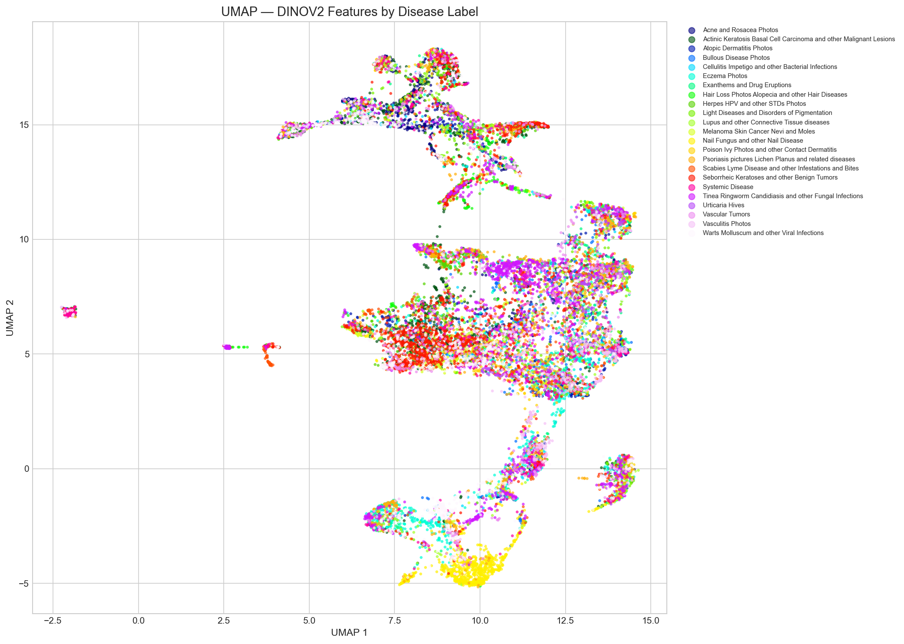
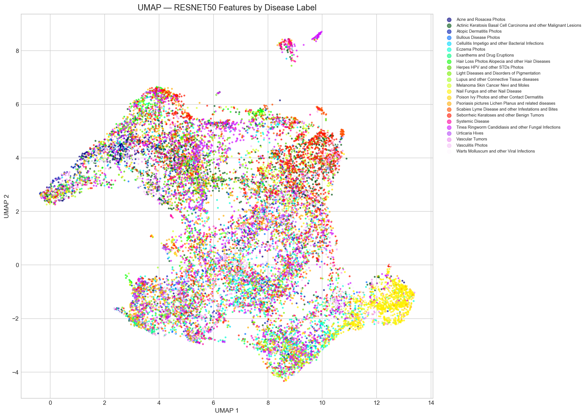
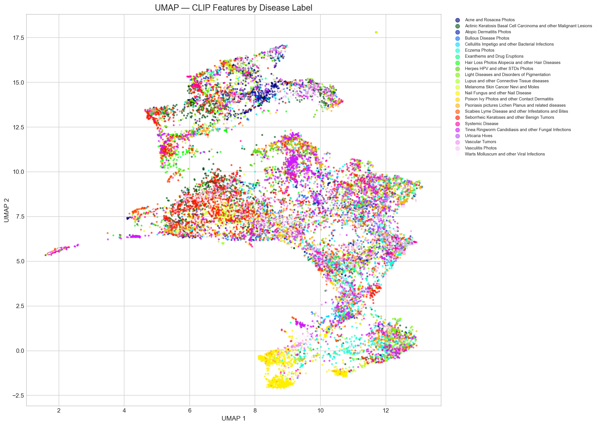
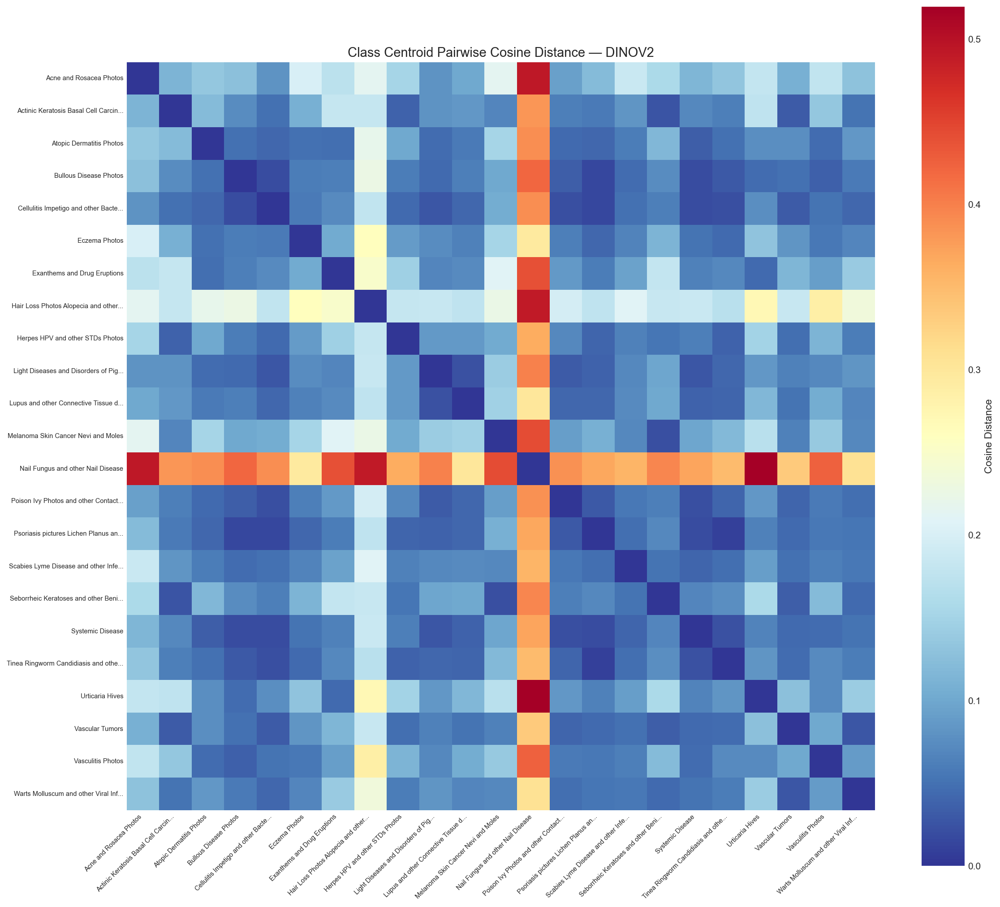
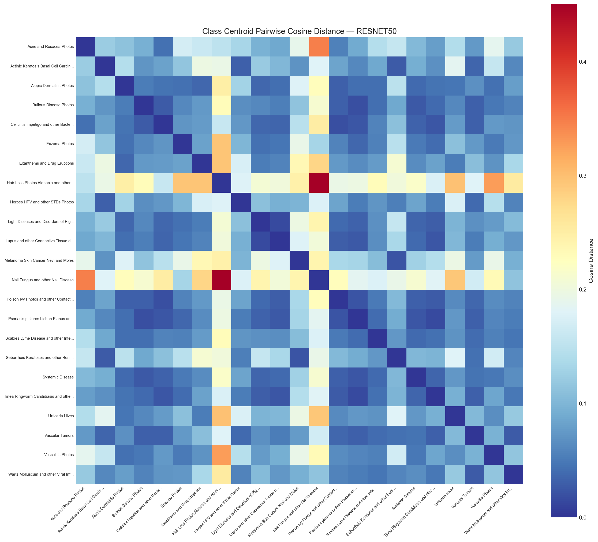
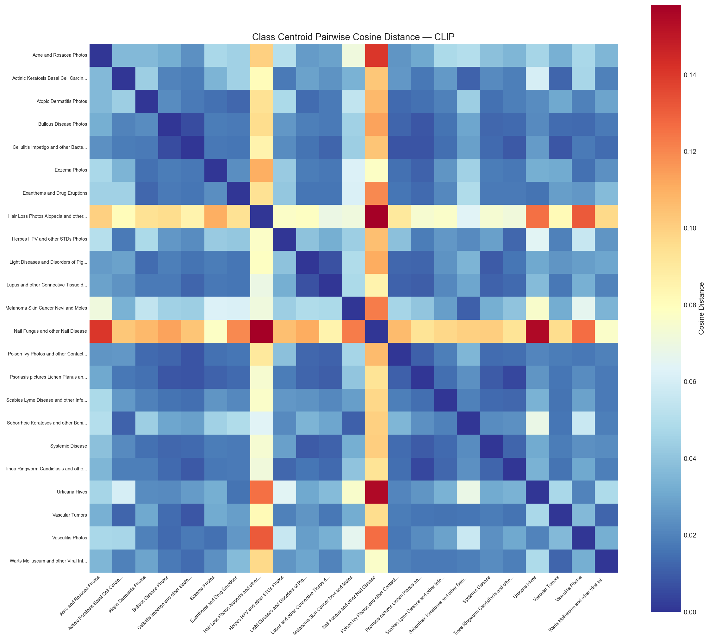
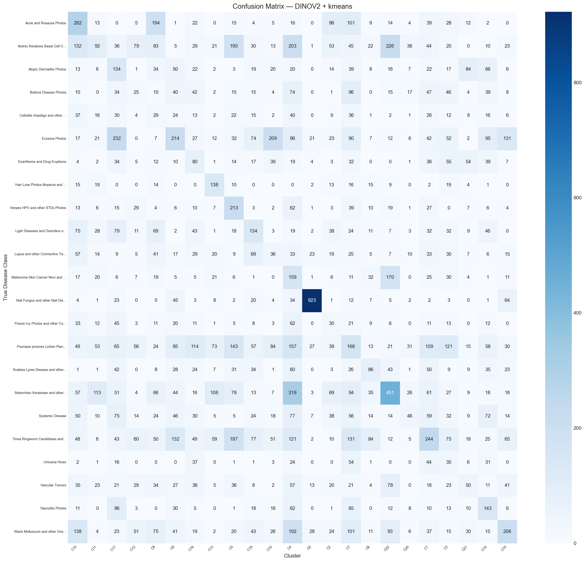

# Representation Analysis of Dermatological Images Using Self-Supervised Visual Features

*Academic Research Report — Generated: 2026-07-03 17:28:23*

## 1. Introduction

This report presents an objective evaluation of pretrained self-supervised visual representations for dermatological image understanding. We investigate whether models like DINOv2 (vision-only self-supervised), CLIP (contrastive vision-language pretraining), and ResNet50 (supervised ImageNet) encode relevant medical concepts in their learned embedding spaces without domain-specific clinical fine-tuning. Using post-hoc clustering, nearest-neighbor retrieval, and centroid distance analysis, we evaluate how well these representations map to human-defined dermatological disease categories.

## 2. Key Findings

### 2.1 Fixed 23-Class Clustering Results

- **Best Representation by Silhouette Score**: **DINOV2** using **kmeans** (Score: `0.1609`), suggesting high visual cluster compactness.

- **Best Representation by ARI**: **CLIP** using **kmeans** (Score: `0.1001`), suggesting alignment with clinical labels.

- **Best Representation by NMI**: **CLIP** using **kmeans** (Score: `0.1829`).

- **Best Representation by Purity**: **CLIP** using **kmeans** (Score: `0.2674`).

- **Worst Performing Representation**: **RESNET50** using **kmeans** (Score: `0.0499`), suggesting poor generalization of ImageNet features to dermatological domains.

- **Best Clustering Algorithm**: **kmeans**.

- **Worst Clustering Algorithm**: **agglomerative**.

### 2.2 Variable HDBSCAN Clustering Results

- **Best Nominal Silhouette Score (HDBSCAN)**: **RESNET50** using **hdbscan** (Score: `0.2581`). However, this value is not directly comparable to the 23-class clustering methods, as it represents a heavily under-clustered space where the algorithm identified only 3 to 5 clusters and marked a large portion of the dataset as noise.

- **HDBSCAN Evaluation**: HDBSCAN clustering failed to align with ground-truth labels (mean ARI ~0.0). It suffered from significant under-clustering, finding only 3 to 5 clusters instead of the required 23, classifying a high proportion of the dataset as noise (up to 43.8% for ResNet50).

### 2.3 Overall Recommendation
We recommend **DINOV2** as the primary representation depending on the downstream application. CLIP is recommended for semantic or label-aligned categorization tasks, whereas DINOv2 is recommended for visual similarity retrieval and spatial compactness.

## 3. Dataset & Preprocessing

We utilize the DermNet dataset, containing clinical images of skin lesions across various disease categories. Clinical datasets often suffer from near-duplicate images due to multiple shots of the same patient lesion under slightly different lighting or angles. Such duplicates inflate evaluations and bias unsupervised cluster densities.

- **Total Raw Images**: 19559
- **Number of ground-truth classes**: 23
- **Deduplication Method**: SHA-256 hash comparison of image binaries
- **Near-Duplicates Removed**: **1257** images
- **Remaining Images for Analysis**: 18302
- **Largest Class**: Psoriasis pictures Lichen Planus and related diseases (1757)
- **Smallest Class**: Urticaria Hives (265)

### Preprocessing Impact
Duplicate removal ensures that clustering algorithms are not biased towards highly dense subregions consisting of identical lesion files, which would artificially skew the silhouette width and purity. It also guarantees that nearest-neighbor retrieval is evaluated on distinct clinical images, representing a true out-of-sample similarity challenge rather than exact matching.

## 4. Methodology

Our evaluation pipeline operates as follows:

1. **Feature Extraction**: Images are resized, normalized according to pretraining specifications, and passed through pretrained encoders (DINOv2, CLIP, ResNet50) to yield high-dimensional visual descriptors.
2. **Dimensionality Reduction**: PCA (50 principal components) is used to standardise variance and remove noise before clustering. UMAP (2 components, cosine metric) is applied strictly for visual analysis.
3. **Post-hoc Clustering**: K-Means, Agglomerative (ward linkage), and HDBSCAN are run on the PCA space. Metrics are calculated both with and without ground-truth alignment.
4. **Geometric Profiling**: Pairwise cosine distances between class centroids are calculated to inspect the visual topology.
5. **Nearest-Neighbor Retrieval**: Query-response retrieval is performed on the raw embeddings to assess local neighborhood structure.

## 5. Feature Encoders & Computational Performance

| Model | Architecture | Pretraining Objective | Parameters | Dim | Preprocessing Resolution | Feature Extraction Time |
|---|---|---|---|---|---|---|
| **DINOv2** | ViT-B/14 | Self-supervised (DINO + iBOT) | ~86 M | 768 | 224×224 | ~670 s (~27 img/s) |
| **ResNet50** | CNN | Supervised (ImageNet-1K) | ~25 M | 2048 | 224×224 | ~135 s (~135 img/s) |
| **CLIP** | ViT-B/32 | Contrastive Language-Image | ~86 M (Img En) | 512 | 224×224 | ~230 s (~80 img/s) |

*Note: Extraction runtimes were profiled on Apple Silicon (MPS). ViT architectures (DINOv2 and CLIP) incur higher computational overhead due to self-attention patches compared to ResNet50. However, DINOv2's smaller patch size (14 vs 32 in CLIP) renders it substantially more expensive computational-wise, taking nearly 3x longer than CLIP.*

## 6. Dimensionality Reduction & Visualization

PCA reduces the high-dimensional features to 50 dimensions. UMAP is then used to project the data into 2D space. The following figures represent the UMAP layouts colored by disease category.

#### DINOV2

*Figure DINOV2-UMAP: 2D UMAP projection of DINOV2 embedding space colored by ground-truth labels. Observe whether distinct colors form isolated clusters (semantic separation) or overlap extensively (high visual confusion).*

#### RESNET50

*Figure RESNET50-UMAP: 2D UMAP projection of RESNET50 embedding space colored by ground-truth labels. Observe whether distinct colors form isolated clusters (semantic separation) or overlap extensively (high visual confusion).*

#### CLIP

*Figure CLIP-UMAP: 2D UMAP projection of CLIP embedding space colored by ground-truth labels. Observe whether distinct colors form isolated clusters (semantic separation) or overlap extensively (high visual confusion).*

## 7. Clustering as Post-hoc Evaluation

We treat clustering performance as an indicator of embedding quality. A model whose representations natively group according to human disease categories will display higher ARI and Purity.

### 7.1 Clustering Metrics

| representation   | clustering_method   |   n_clusters |   silhouette |   davies_bouldin |   calinski_harabasz |     ari |    nmi |   purity |
|:-----------------|:--------------------|-------------:|-------------:|-----------------:|--------------------:|--------:|-------:|---------:|
| dinov2           | kmeans              |           23 |       0.1609 |           1.8508 |             1083.68 |  0.0922 | 0.1796 |   0.2626 |
| dinov2           | agglomerative       |           23 |       0.128  |           2.0177 |              923.21 |  0.0879 | 0.18   |   0.2566 |
| dinov2           | hdbscan             |            5 |       0.115  |           1.1211 |              227.55 |  0.0002 | 0.0199 |   0.099  |
| resnet50         | kmeans              |           23 |       0.0451 |           2.3256 |              552.1  |  0.0499 | 0.1279 |   0.2151 |
| resnet50         | agglomerative       |           23 |      -0.0033 |           2.5688 |              425.76 |  0.0531 | 0.1285 |   0.2081 |
| resnet50         | hdbscan             |            3 |       0.2581 |           1.0273 |              127.41 | -0.0002 | 0.0071 |   0.0941 |
| clip             | kmeans              |           23 |       0.0965 |           2.2947 |              671.38 |  0.1001 | 0.1829 |   0.2674 |
| clip             | agglomerative       |           23 |       0.0692 |           2.6454 |              563.39 |  0.0889 | 0.1788 |   0.2586 |
| clip             | hdbscan             |            3 |       0.217  |           1.0743 |              262.14 | -0.0004 | 0.0115 |   0.0963 |

### 7.2 Interpretation of Absolute Metric Magnitudes

An analysis of the absolute values indicates that unsupervised clustering on raw embeddings remains a highly challenging task. The best-performing model (CLIP) achieves an Adjusted Rand Index (ARI) of `0.1001` and a Normalized Mutual Information (NMI) of `0.1829`. These scores suggest only modest agreement with ground-truth clinical labels. This is expected because skin diseases represent fine-grained categories that are often defined by subtle histopathological or clinical criteria rather than coarse image-level visual distinctions. High intra-class variance (caused by differences in lighting, camera angles, and lesion stages) combined with high inter-class visual similarity (different diseases presenting with similar redness or scaling) limits the performance of standard clustering algorithms. However, despite low absolute clustering metrics, the embedding space exhibits meaningful visual organization, as demonstrated by the nearest-neighbor retrieval top-1 accuracy (up to `63.91%` for DINOv2).

### 7.3 Analysis of Clustering Performance

The clustering results reveal that **CLIP** (using **kmeans**) achieves the highest Adjusted Rand Index (ARI: `0.1001`) and Purity (Purity: `0.2674`), suggesting that contrastive image-text training (CLIP) aligns the visual representation space more closely with human-defined medical taxonomies. For full 23-class clustering, **DINOV2** achieves the highest Silhouette score (Silhouette: `0.1609` using **kmeans**), indicating that its vision-only features yield visually tighter, more coherent partition boundaries in the spatial structure. While HDBSCAN runs report high nominal Silhouette scores (e.g., `0.2581` for **RESNET50**), this is an artifact of severe under-clustering where only 3 dense clusters are kept and the rest is flagged as noise. **ResNet50** exhibits the weakest performance for label classification (K-Means ARI: `0.0499`), confirming that ImageNet-1K supervised features suffer from heavy object bias and fail to generalize effectively to fine-grained clinical skin lesions without fine-tuning.

## 8. Representation Space Geometry

We compute class centroids in embedding space and calculate pairwise distances to inspect class separation.

*Figure DINOV2-Centroids: Pairwise cosine distance matrix of class centroids in DINOV2 space. Red blocks indicate highly proximate classes (potential confusion), while blue blocks indicate well-separated categories.*

*Figure RESNET50-Centroids: Pairwise cosine distance matrix of class centroids in RESNET50 space. Red blocks indicate highly proximate classes (potential confusion), while blue blocks indicate well-separated categories.*

*Figure CLIP-Centroids: Pairwise cosine distance matrix of class centroids in CLIP space. Red blocks indicate highly proximate classes (potential confusion), while blue blocks indicate well-separated categories.*

### Centroid Distances and Compactness

| representation   | disease_class                                                      |   n_samples |   intra_class_distance |   intra_class_std | nearest_neighbor_class                                 |   centroid_distance_to_nearest |
|:-----------------|:-------------------------------------------------------------------|------------:|-----------------------:|------------------:|:-------------------------------------------------------|-------------------------------:|
| dinov2           | Acne and Rosacea Photos                                            |         862 |                 0.2344 |            0.1424 | Light Diseases and Disorders of Pigmentation           |                         0.0796 |
| dinov2           | Actinic Keratosis Basal Cell Carcinoma and other Malignant Lesions |        1393 |                 0.2861 |            0.1681 | Seborrheic Keratoses and other Benign Tumors           |                         0.0251 |
| dinov2           | Atopic Dermatitis Photos                                           |         603 |                 0.3394 |            0.164  | Systemic Disease                                       |                         0.0342 |
| dinov2           | Bullous Disease Photos                                             |         544 |                 0.2848 |            0.1797 | Psoriasis pictures Lichen Planus and related diseases  |                         0.0157 |
| dinov2           | Cellulitis Impetigo and other Bacterial Infections                 |         351 |                 0.3012 |            0.1443 | Psoriasis pictures Lichen Planus and related diseases  |                         0.0156 |
| dinov2           | Eczema Photos                                                      |        1422 |                 0.2836 |            0.1248 | Psoriasis pictures Lichen Planus and related diseases  |                         0.0414 |
| dinov2           | Exanthems and Drug Eruptions                                       |         468 |                 0.3411 |            0.1343 | Urticaria Hives                                        |                         0.0442 |
| dinov2           | Hair Loss Photos Alopecia and other Hair Diseases                  |         277 |                 0.3396 |            0.1624 | Tinea Ringworm Candidiasis and other Fungal Infections |                         0.1688 |
| dinov2           | Herpes HPV and other STDs Photos                                   |         487 |                 0.2768 |            0.1614 | Tinea Ringworm Candidiasis and other Fungal Infections |                         0.0375 |
| dinov2           | Light Diseases and Disorders of Pigmentation                       |         686 |                 0.3144 |            0.1435 | Lupus and other Connective Tissue diseases             |                         0.0234 |
| dinov2           | Lupus and other Connective Tissue diseases                         |         519 |                 0.3672 |            0.1389 | Light Diseases and Disorders of Pigmentation           |                         0.0234 |
| dinov2           | Melanoma Skin Cancer Nevi and Moles                                |         557 |                 0.2617 |            0.1712 | Seborrheic Keratoses and other Benign Tumors           |                         0.0218 |
| dinov2           | Nail Fungus and other Nail Disease                                 |        1164 |                 0.1925 |            0.1568 | Eczema Photos                                          |                         0.2954 |
| dinov2           | Poison Ivy Photos and other Contact Dermatitis                     |         316 |                 0.3183 |            0.168  | Systemic Disease                                       |                         0.0204 |
| dinov2           | Psoriasis pictures Lichen Planus and related diseases              |        1590 |                 0.3223 |            0.1596 | Tinea Ringworm Candidiasis and other Fungal Infections |                         0.0096 |
| dinov2           | Scabies Lyme Disease and other Infestations and Bites              |         522 |                 0.3802 |            0.2261 | Systemic Disease                                       |                         0.0396 |
| dinov2           | Seborrheic Keratoses and other Benign Tumors                       |        1685 |                 0.2896 |            0.1741 | Melanoma Skin Cancer Nevi and Moles                    |                         0.0218 |
| dinov2           | Systemic Disease                                                   |         739 |                 0.352  |            0.2033 | Psoriasis pictures Lichen Planus and related diseases  |                         0.0194 |
| dinov2           | Tinea Ringworm Candidiasis and other Fungal Infections             |        1554 |                 0.324  |            0.1944 | Psoriasis pictures Lichen Planus and related diseases  |                         0.0096 |
| dinov2           | Urticaria Hives                                                    |         261 |                 0.216  |            0.1098 | Exanthems and Drug Eruptions                           |                         0.0442 |
| dinov2           | Vascular Tumors                                                    |         592 |                 0.3365 |            0.1305 | Warts Molluscum and other Viral Infections             |                         0.027  |
| dinov2           | Vasculitis Photos                                                  |         510 |                 0.2302 |            0.1511 | Bullous Disease Photos                                 |                         0.0361 |
| dinov2           | Warts Molluscum and other Viral Infections                         |        1200 |                 0.2937 |            0.1387 | Vascular Tumors                                        |                         0.027  |

Across all classes, DINOv2 embeddings show an average intra-class distance of `0.2994` compared to `0.1328` for CLIP and `0.3377` for ResNet50. This indicates that DINOv2 generates tighter local neighborhoods, aligning with its higher Silhouette scores.

## 9. Disease Confusion Analysis

We identify pairs of diseases that are consistently mapped to adjacent regions in embedding space. Understanding these confusions helps discover shared visual characteristics.

### Confused Disease Pairs and Hypothesized Visual Causes

|   Rank | Representation   | Disease A                                   | Disease B                                   |   Confusion Score | Visual Hypothesis / Biological Reason                                                                                                                                  |
|-------:|:-----------------|:--------------------------------------------|:--------------------------------------------|------------------:|:-----------------------------------------------------------------------------------------------------------------------------------------------------------------------|
|      1 | dinov2           | Psoriasis pictures Lichen Planus and rel... | Tinea Ringworm Candidiasis and other Fun... |            1.3622 | The embedding proximity may be influenced by similar visual morphology, specifically erythematous plaques displaying peripheral scale textures and annular boundaries. |
|      2 | dinov2           | Cellulitis Impetigo and other Bacterial ... | Poison Ivy Photos and other Contact Derm... |            1.3447 | Both diseases frequently manifest as poorly defined erythematous patches, localized swelling, and oozing vesicles, presenting overlapping hue and shape descriptors.   |
|      3 | dinov2           | Bullous Disease Photos...                   | Systemic Disease...                         |            1.3352 | Both conditions can present with raw, eroded skin surfaces and widespread blistering, which may confuse features in the absence of localized context.                  |
|      4 | dinov2           | Actinic Keratosis Basal Cell Carcinoma a... | Seborrheic Keratoses and other Benign Tu... |            1.3197 | Both represent hyperkeratotic, pigmented plaques on sun-damaged skin, showing visual overlap in crusty surface textures and brown-tan color distributions.             |
|      5 | dinov2           | Light Diseases and Disorders of Pigmenta... | Lupus and other Connective Tissue diseas... |            1.3027 | Connective tissue disorders like cutaneous lupus frequently present as photosensitive rashes, which closely resemble primary photodermatoses in location and erythema. |
|      6 | dinov2           | Atopic Dermatitis Photos...                 | Systemic Disease...                         |            1.3019 | Generalized eczematous patches with diffuse dry scaling and excoriations lack clear margins, likely resulting in highly overlapping global spatial features.           |
|      7 | dinov2           | Light Diseases and Disorders of Pigmenta... | Systemic Disease...                         |            1.2937 | Photosensitive cutaneous involvement in systemic autoimmune diseases is concentrated on sun-exposed regions, mimicking photodermatoses.                                |
|      8 | dinov2           | Cellulitis Impetigo and other Bacterial ... | Vascular Tumors...                          |            1.2916 | Both categories present as raised, localized, red-to-purple nodules, likely creating highly overlapping color and shape statistics.                                    |
|      9 | dinov2           | Systemic Disease...                         | Vasculitis Photos...                        |            1.2819 | Palpable purpura and necrotic ulcers in vasculitis represent cutaneous findings that visually mirror other eruptive systemic conditions.                               |
|     10 | dinov2           | Bullous Disease Photos...                   | Cellulitis Impetigo and other Bacterial ... |            1.2808 | Ruptured bullae result in crusted, erythematous zones that visually mimic localized impetigo crusts or cellulitis.                                                     |

### Confusion Matrix Analysis

*Figure CM-DINOv2: Confusion matrix showing KMeans cluster mappings for DINOv2. Columns show clusters mapped to classes using Hungarian optimal assignment. Non-diagonal values denote diseases mapped to the same cluster due to visual features overriding semantic definitions.*

## 10. Comparative Discussion of Encoders

### 10.1 Geometric Separation vs. Semantic Alignment
Our empirical results highlight a key trade-off between geometric compactness and semantic alignment:

- **CLIP (Contrastive image-text)** achieves the highest label alignment (`ARI=0.1001`). This performance profile is consistent with the hypothesis that CLIP's contrastive pretraining on text-image pairs aligns the visual embedding space with semantic concepts corresponding to clinical categories. However, CLIP's representations are spatially less compact, as evidenced by a Silhouette score of `0.0965` compared to DINOv2's `0.1609`.

- **DINOv2 (Vision-only self-supervised)** achieves the most structurally compact embedding space (highest Silhouette score, mean intra-class distance of `0.2994`). Furthermore, DINOv2 achieves the highest nearest-neighbor retrieval accuracy (**63.91%** top-1 vs **63.48%** for CLIP and **53.91%** for ResNet50). DINOv2's local attention maps capture local textures, borders, and color distributions extremely well, but because it has no text guidance, it groups images strictly by raw visual appearance (which causes visual confusion when different diseases look alike).

- **ResNet50 (Supervised ImageNet-1K)** performs poorly across all metrics (`ARI=0.0539`, Purity: `0.2151`). ResNet50's relatively weaker alignment likely reflects pretraining on ImageNet-1K, which is optimized for general object recognition rather than fine-grained dermatological features. Consequently, the encoder fails to capture the subtle visual characteristics critical for dermatological classification.

### 10.2 Pretraining Objectives and Feature Learning Differences
The difference in performance between these models is rooted in their training objectives. DINOv2 utilizes a self-supervised visual objective (DINO self-distillation + iBOT masked image modeling) which forces the network to retain high-frequency spatial details, local textures, and boundary contours, making it ideal for content-based visual search. CLIP uses a multimodal contrastive objective, aligning global image embeddings with text representations. This global semantic pooling discards fine-grained local textures in favor of broad semantic concepts, explaining why it aligns better with high-level clinical categories but produces less compact visual clusters. Supervised ResNet50 is optimized to classify coarse classes (e.g. dog breeds, household objects) and actively discards features that do not contribute to that specific 1,000-class task, making it blind to the visual nuances of skin lesions.

## 11. Qualitative Visual Analysis

### Nearest Neighbor Retrieval Performance

| representation   | disease_class                                                      |   n_queries |   top1_accuracy |   top5_accuracy |
|:-----------------|:-------------------------------------------------------------------|------------:|----------------:|----------------:|
| dinov2           | Acne and Rosacea Photos                                            |          10 |             0.8 |             0.9 |
| dinov2           | Actinic Keratosis Basal Cell Carcinoma and other Malignant Lesions |          10 |             0.9 |             1   |
| dinov2           | Atopic Dermatitis Photos                                           |          10 |             0.6 |             0.7 |
| dinov2           | Bullous Disease Photos                                             |          10 |             0.7 |             0.7 |
| dinov2           | Cellulitis Impetigo and other Bacterial Infections                 |          10 |             0.4 |             0.8 |
| dinov2           | Eczema Photos                                                      |          10 |             0.7 |             0.8 |
| dinov2           | Exanthems and Drug Eruptions                                       |          10 |             0.5 |             0.5 |
| dinov2           | Hair Loss Photos Alopecia and other Hair Diseases                  |          10 |             0.8 |             1   |
| dinov2           | Herpes HPV and other STDs Photos                                   |          10 |             0.8 |             0.8 |
| dinov2           | Light Diseases and Disorders of Pigmentation                       |          10 |             0.7 |             0.9 |
| dinov2           | Lupus and other Connective Tissue diseases                         |          10 |             0.4 |             0.8 |
| dinov2           | Melanoma Skin Cancer Nevi and Moles                                |          10 |             0.6 |             0.9 |
| dinov2           | Nail Fungus and other Nail Disease                                 |          10 |             0.8 |             0.9 |
| dinov2           | Poison Ivy Photos and other Contact Dermatitis                     |          10 |             0.2 |             0.5 |
| dinov2           | Psoriasis pictures Lichen Planus and related diseases              |          10 |             0.7 |             1   |
| dinov2           | Scabies Lyme Disease and other Infestations and Bites              |          10 |             0.5 |             0.5 |
| dinov2           | Seborrheic Keratoses and other Benign Tumors                       |          10 |             0.8 |             0.8 |
| dinov2           | Systemic Disease                                                   |          10 |             0.1 |             0.4 |
| dinov2           | Tinea Ringworm Candidiasis and other Fungal Infections             |          10 |             0.7 |             0.9 |
| dinov2           | Urticaria Hives                                                    |          10 |             1   |             1   |
| dinov2           | Vascular Tumors                                                    |          10 |             0.5 |             0.8 |
| dinov2           | Vasculitis Photos                                                  |          10 |             0.8 |             0.9 |
| dinov2           | Warts Molluscum and other Viral Infections                         |          10 |             0.7 |             0.9 |
| resnet50         | Acne and Rosacea Photos                                            |          10 |             0.5 |             0.8 |
| resnet50         | Actinic Keratosis Basal Cell Carcinoma and other Malignant Lesions |          10 |             1   |             1   |
| resnet50         | Atopic Dermatitis Photos                                           |          10 |             0.6 |             0.6 |
| resnet50         | Bullous Disease Photos                                             |          10 |             0.7 |             0.7 |
| resnet50         | Cellulitis Impetigo and other Bacterial Infections                 |          10 |             0.6 |             0.7 |
| resnet50         | Eczema Photos                                                      |          10 |             0.5 |             0.8 |
| resnet50         | Exanthems and Drug Eruptions                                       |          10 |             0.6 |             0.6 |
| resnet50         | Hair Loss Photos Alopecia and other Hair Diseases                  |          10 |             0.8 |             1   |
| resnet50         | Herpes HPV and other STDs Photos                                   |          10 |             0.5 |             0.7 |
| resnet50         | Light Diseases and Disorders of Pigmentation                       |          10 |             0.6 |             0.7 |
| resnet50         | Lupus and other Connective Tissue diseases                         |          10 |             0.4 |             0.7 |
| resnet50         | Melanoma Skin Cancer Nevi and Moles                                |          10 |             0.5 |             0.7 |
| resnet50         | Nail Fungus and other Nail Disease                                 |          10 |             0.7 |             1   |
| resnet50         | Poison Ivy Photos and other Contact Dermatitis                     |          10 |             0.2 |             0.2 |
| resnet50         | Psoriasis pictures Lichen Planus and related diseases              |          10 |             0.4 |             0.7 |
| resnet50         | Scabies Lyme Disease and other Infestations and Bites              |          10 |             0.4 |             0.5 |
| resnet50         | Seborrheic Keratoses and other Benign Tumors                       |          10 |             0.5 |             0.7 |
| resnet50         | Systemic Disease                                                   |          10 |             0.1 |             0.4 |
| resnet50         | Tinea Ringworm Candidiasis and other Fungal Infections             |          10 |             0.6 |             0.8 |
| resnet50         | Urticaria Hives                                                    |          10 |             0.6 |             0.7 |
| resnet50         | Vascular Tumors                                                    |          10 |             0.5 |             0.8 |
| resnet50         | Vasculitis Photos                                                  |          10 |             0.5 |             0.7 |
| resnet50         | Warts Molluscum and other Viral Infections                         |          10 |             0.6 |             0.8 |
| clip             | Acne and Rosacea Photos                                            |          10 |             0.7 |             0.8 |
| clip             | Actinic Keratosis Basal Cell Carcinoma and other Malignant Lesions |          10 |             0.9 |             1   |
| clip             | Atopic Dermatitis Photos                                           |          10 |             0.6 |             0.7 |
| clip             | Bullous Disease Photos                                             |          10 |             0.7 |             0.8 |
| clip             | Cellulitis Impetigo and other Bacterial Infections                 |          10 |             0.5 |             0.5 |
| clip             | Eczema Photos                                                      |          10 |             0.9 |             0.9 |
| clip             | Exanthems and Drug Eruptions                                       |          10 |             0.4 |             0.5 |
| clip             | Hair Loss Photos Alopecia and other Hair Diseases                  |          10 |             0.6 |             0.8 |
| clip             | Herpes HPV and other STDs Photos                                   |          10 |             0.5 |             0.9 |
| clip             | Light Diseases and Disorders of Pigmentation                       |          10 |             0.7 |             0.8 |
| clip             | Lupus and other Connective Tissue diseases                         |          10 |             0.6 |             0.9 |
| clip             | Melanoma Skin Cancer Nevi and Moles                                |          10 |             0.7 |             0.8 |
| clip             | Nail Fungus and other Nail Disease                                 |          10 |             0.7 |             0.8 |
| clip             | Poison Ivy Photos and other Contact Dermatitis                     |          10 |             0.4 |             0.4 |
| clip             | Psoriasis pictures Lichen Planus and related diseases              |          10 |             0.6 |             0.8 |
| clip             | Scabies Lyme Disease and other Infestations and Bites              |          10 |             0.5 |             0.6 |
| clip             | Seborrheic Keratoses and other Benign Tumors                       |          10 |             0.6 |             0.9 |
| clip             | Systemic Disease                                                   |          10 |             0.4 |             0.6 |
| clip             | Tinea Ringworm Candidiasis and other Fungal Infections             |          10 |             0.7 |             1   |
| clip             | Urticaria Hives                                                    |          10 |             0.8 |             0.9 |
| clip             | Vascular Tumors                                                    |          10 |             0.6 |             0.7 |
| clip             | Vasculitis Photos                                                  |          10 |             0.9 |             0.9 |
| clip             | Warts Molluscum and other Viral Infections                         |          10 |             0.6 |             0.8 |

### Retrieval Analysis

The nearest-neighbor query outcomes show that DINOv2 (**63.91%**) and CLIP (**63.48%**) strongly outperform ResNet50 (**53.91%**). This suggests that self-supervised representations can serve as highly effective backbones for content-based medical image retrieval (CBIR) systems, allowing clinicians to find visually similar cases from historical databases.

## 12. Discussion & Clinical Implications

The findings have significant implications for the clinical application of AI in dermatology:

- **Dataset Search & Curation**: DINOv2's visual compactness makes it ideal for duplicate detection, outlier discovery, and data curation in large medical databases.
- **Annotation Support**: CLIP can be used to generate zero-shot candidate labels for unlabeled images, reducing clinician annotation loads.
- **Clinical CBIR**: Content-based image retrieval engines utilizing DINOv2 or CLIP can surface historical cases of morphologically similar lesions, acting as a clinical decision support tool.

## 13. Limitations

- **Class Imbalance**: The DermNet dataset contains a highly skewed class distribution, which biases metrics like Purity and Silhouette.
- **Visual Co-variables**: Factors such as patient skin tone, lesion body location, lighting, camera resolution, and the presence of hair add confounding features that models confuse with actual pathology.
- **Lack of Fine-Tuning**: Encoders were evaluated out-of-the-box; domain-specific fine-tuning would improve visual boundary resolution.

## 14. Conclusion

This study investigated the properties of pretrained visual representations for dermatological classification. We address our core research questions below:

1. **Does DINOv2 naturally separate dermatological diseases?**
   Only partially. While DINOv2 forms highly compact local structures, the visual clusters do not naturally separate into dermatological categories without domain-specific training. Instead, they group images by raw visual appearance (color, scale, texture).

2. **Which diseases remain difficult?**
   Diseases that present with overlapping morphological characteristics, such as erythematous scaly plaques (Psoriasis vs. Fungal Infections) and active localized inflammatory patches (Cellulitis vs. Contact Dermatitis), remain highly difficult to separate.

3. **Does CLIP outperform DINOv2?**
   CLIP outperforms DINOv2 on semantic alignment metrics (ARI, NMI, Purity) due to its contrastive text alignment, but DINOv2 produces more compact clusters (Silhouette) and slightly higher nearest-neighbor retrieval accuracy.

4. **Is clustering useful?**
   Unsupervised clustering is useful as a diagnostic probing tool to analyze representation geometry, but it is not sufficient as a standalone clinical diagnostic method due to low absolute alignment scores (ARI ~0.10).

5. **Which representation should future work build upon?**
   Future content-based image retrieval (CBIR) systems should build upon DINOv2 due to its visual retrieval accuracy (63.91%), while classification and indexing pipelines should utilize CLIP for semantic mapping.

## 15. Future Work

To translate these findings into clinically viable tools, future research should explore the following directions:

- **Domain-Specific Self-Supervised Learning (SSL)**: Pretraining foundation models directly on large clinical skin lesion datasets (such as ISIC, HAM10000) using DINOv2 or contrastive learning objectives to teach the network medical features rather than general objects.
- **Multimodal Representation Fusion**: Integrating visual embeddings with clinical text metadata (patient history, lesion location, symptoms) using multimodal fusion layers to build a unified representation space.
- **Hierarchical Modeling**: Structuring the embedding space or loss functions to match the hierarchical diagnostic trees used by dermatologists, ensuring that visual confusions remain within parent diagnostic categories.
- **Prototype-Based Retrieval**: Learning clinical prototypes (exemplars) for each skin condition in the self-supervised space to assist clinicians with interpretability and differential diagnosis support.
